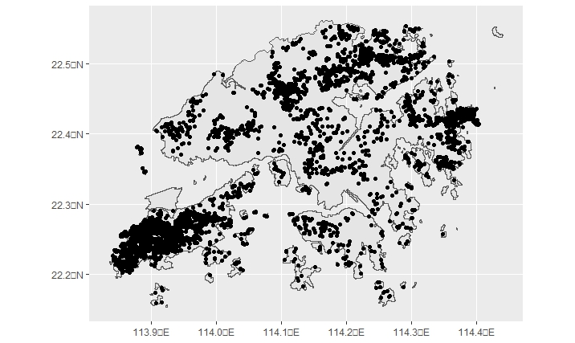
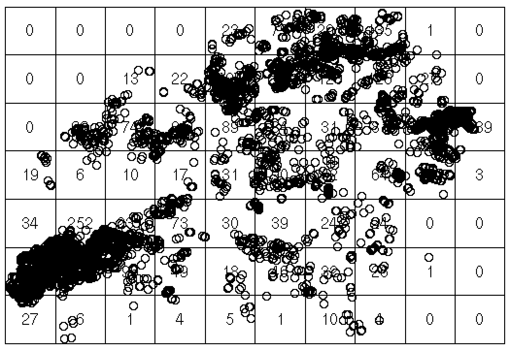
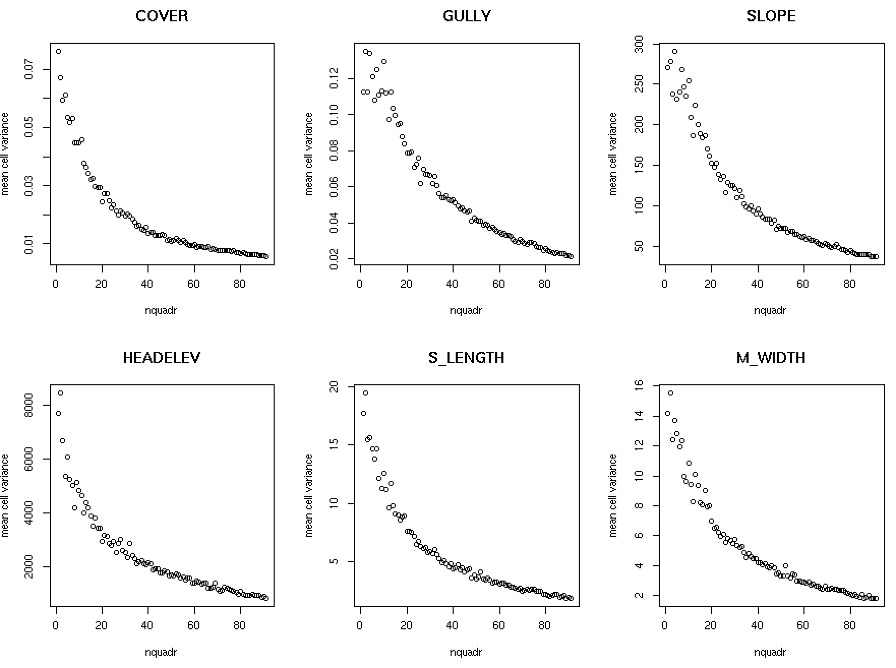
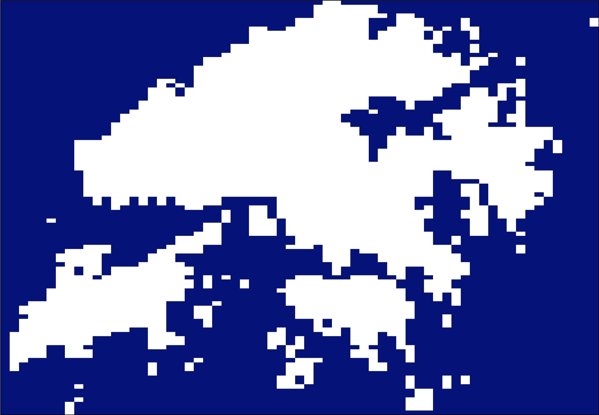
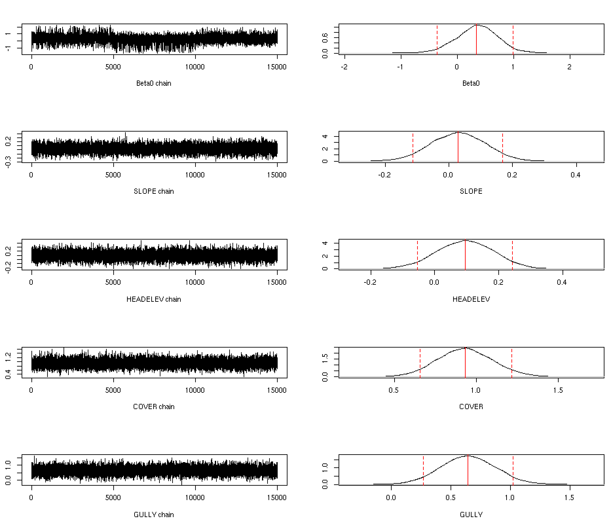
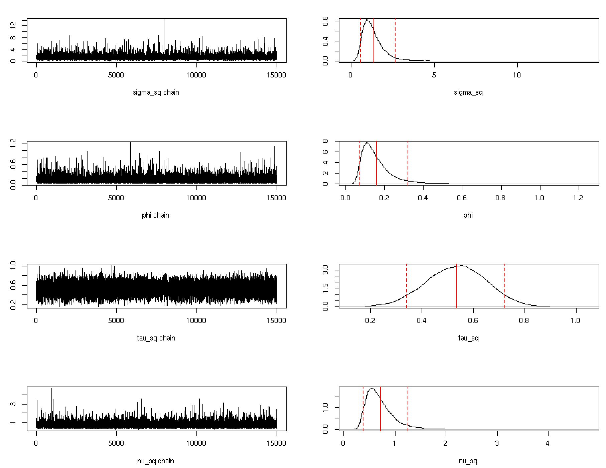
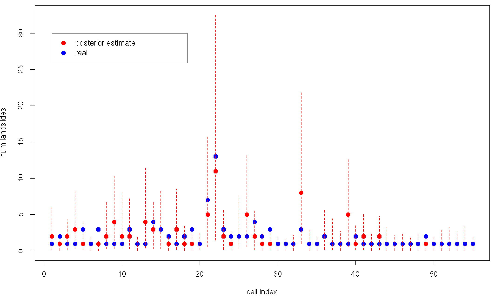

# HongKongLandslides

    

|**Languages** | **Libraries** |
| -----| ---- |
| |        

<a name="description"/>

## Description
Modelling historical landslide occurrences in Hong Kong through Bayesian statistical analysis.  Spatial covariance between observation sites is modelled and leveraged for informative kriging in a predictive phase. 

Relevant datasets for the project can be found through the [Enhanced Natural Terrain Landslide Inventory](https://data.gov.hk/en-data/dataset/hk-cedd-csu-cedd-entli) repository provided by the government of Hong Kong.  

The two main scripts driving this project are `mask_generation.R` which extracts the grid cells corresponding to hong kong from the bounding box, and `kriging.R` in which model fitting and prediction are performed. Hyperparameters in the former with respect to the level of grid refinement can allow for faster model fitting times with rstan but at the expense of potential non-informativeness of the geostatistical covariates aggregated over the larger grid cells. 

<a name="motivation"/>

## Motivation
In this project we attempt to uncover the relationship between geostatistical covariates and the frequency of landslides in a given region, whilst also considering the influence each region exerts on one another due to spatial proximity. 

Through relevant Bayesian modelling which uncovers influential covariates in our generalized linear model (GLM) stands the potential for informing government spending to implement relevant infrastructures for reinforcing identified at-risk regions, which consequently could save lives in the process.

<a name="dataset"/>

## Dataset

|**Covariate** | **Description** |
| -----| ---- |
| SLIDE_TYPE | categorical variable classifying the observations as relict landslide("R”),  landslide with recent channelized debris flow ("C”), landslide with open hillslope ("O”), recent coastal landslide ("S”) |
| M_WIDTH | width of the landslide main scarp (in metres) |
| S_LENGTH | length of the landslide source area (in metres) |
| SLOPE | ground slope angle across the landslide head |
| COVER | categorical variable classifying the landslides based on the vegetation cover. Values fall into the categories of totally bare of vegetation ("A"), partially bare of vegetation ("B"), completely covered by grass ("C"), covered in shrubs and/or trees ("D") |
| YEAR_1 | year of the serial photograph on which the landslide was first observed |
| HEADELEV | elevation of the landslide’s crown (in mPD, i.e. metres above principal datum) |
| TAILELEV | elevation of landslide toe (in mPD) |
| ELEV_DIFF | elevation difference between landslide crown and toe in metres |
| GULLY | categorical variable classifying landslides belonging to a previously recorded area of gully erosion ("Y”) and landslides belonging outside of this area ("N”) |
| NORTHING & EASTING | coordinates of the landslides |

<a name="model"/>

## Model 
We consider a Cox generalized linear model with link function given by the exponential to model the intensity surface which drives landslide occurences, $Y(s_{i})$, in each grid cell, $s_{i}\in D\subset \mathbb{R}^{2}$. Essentially this intensity surfce takes into account underlying geospatial covariates along with assumed noise given by measurement errors and influences due to spatial proximity, and maps them to a scalar denoting the rate of landslide occurences in the given cell. 

We assume an exponential covariance function, $\rho$, though one can certainly consider a CAR formulation in which the sparsity of the proximity matrix allows for faster computations at higher levels of grid refinement. 

$$\begin{align*}Y(s_{i}) | \lambda &\sim Po(\lambda(s_{i}))\\\\\\
\log \lambda(s_{i}) | \beta, w, \epsilon &= X(s_{i})\beta + w(s_{i}) + \epsilon(s_{i})\\\\\\
\beta | \nu &\sim \mathcal{N}(\textbf{0}, \nu^{2} I_{k+1})\\\\\\
\epsilon(s_{1}), \epsilon(s_{2}), ... \epsilon(s_{n}) | \tau^{2}&\overset{iid}{\sim} \mathcal{N}(0, \tau^{2})\\\\\\
\textbf{w} | \sigma^{2}, \phi &\sim \mathcal{N}_{n}(\textbf{0}, \sigma^{2}\rho(\cdot;\phi))\\\\\\
\tau^{2} &\sim inv-gamma(1,1)\\\\\\
\nu^{2} &\sim inv-gamma(1,1)\\\\\\
\sigma^{2} &\sim \mathcal{HC}(0,1)\\\\\\
\phi &\sim inv-gamma(4,1)\end{align*}$$

Data used to train the model consists of aggregated landslide counts in the grid cells defining Hong Kong.  These labels - and the underlying features - are highly subjective to the hyperparameter which controls the grid refinement.  To choose grid dimensions which provide an adequate trade-off between covariate inhomogeneity and cell granularity we plot elbow curves of the within sum of squares for covariates in the cells and make an informed choice. 

    
    

    

<a name="results"/>

## Results 
To fit the model outlined above we use landslide data collected from years 2016 through 2018, and reserve 2019 records for a predictive phase. Standardization is carried out on the numerical features, with the associated normalization parameters saved for use on the test data, and categorical variables are amalgamated to binary indications. A grid size of 21x30 cells is used, with one grid cell corresponding to areal units of roughly 2kmx2km. 

As a prelimnary step, a mask is generated from a supplementary shapefile of the Hong Kong geography in order to ensure only samples belonging within the country's borders are included in the fitting. 

The Bayesian model is fit using `rstan` within R and the posterior chains were generated.  From the posterior distributions of the model parameters we see that the only influential regressors in determining landslide propensity are the binary indicators for previously recorded erosion and lack of vegetation. 

Using now the multivariate normal updates at the log scale for the intensity surface conditional on observations in the training set, we can numerically evaluate the posterior predictive density with basic Monte Carlo methods.  For a full description of the mathematics involved please see `report.pdf` as github currently has limitations on LaTeX renderings in the readME. 

Plotted above are the predictions on the test data, with the 90% confidence intervals represented by the dashed red lines. Making the appropriate Bonferroni corrections we estimate that with probability 90% that anywhere from 0 to 1603 landslides will occur in the year 2019.  Taking the estimation in expectation we predict that 111 landslides will occur - a value consistent with the real number being 105. 

The confidence intervals for the predictive model could be tightened through the use of more informative covariates such as regional precipitation measurements, but despite best efforts we could not include such data in the modelling.  This represents a potential next direction for the modelling efforts. 

